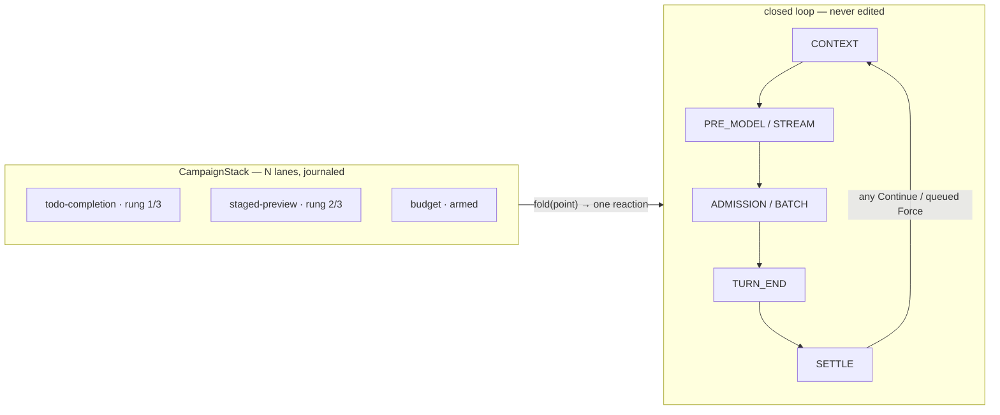

# Campaigns — durable takeover regions for the agent loop

> Owner doc for `@omp.campaign`, `omp.Point`, the campaign verdict vocabulary (`omp.Pass` /
> `omp.Inject` / `omp.Patch` / `omp.Hold` / `omp.Deny` / `omp.Continue` / `omp.Force` /
> `omp.Cut` / `omp.Bind` / `omp.Done` / `omp.Exhausted` / `omp.Escalate`), typed
> `family@rev` state, the bounded policy, the per-point arbiter fold and its precedence,
> the claim/slot queue, monitors, the blackboard, campaign
> durability and revival, and the lane projection the UI renders.
> Rust side: `crates/agent/src/campaign.rs`, its
> integration table into `crates/agent/src/loop.rs`, and the subsumption map over
> `tool_choice.rs`, `mailbox.rs`, `continuation.rs`, `approvals.rs`, `ttsr.rs`.
> Validation corpus: `.gap/composition/` — all ~50 pi takeover flows sketched against this
> interface (draft surface `_spec.py`, revision r2); §8 records what that exercise changed.
> Siblings: [`00-overview.md`](00-overview.md) (host, sockets, lifecycle, `omp.Context`),
> [`05-hooks.md`](05-hooks.md) (the *stateless* decision spine campaigns build on),
> [`08-context.md`](08-context.md) (`ContextPatch`, prompt slots),
> [`12-agents.md`](12-agents.md) (`Continue`/`Settle`, subagents),
> [`06-policy.md`](06-policy.md) (approval tickets, tiers).

## 1. Purpose

A hook answers a question the harness asks once: *may this tool call run?* A **campaign** is the
other thing pi never had a name for: a stateful, multi-turn takeover that reminds, then
escalates, then forces, then gives up, and must remain correct while any number of its siblings
run the same play at the same time.

pi has at least 52 of these (inventoried in the takeover atlas). Every one hand-rolls the same
four-part skeleton — trigger, private escalation counter, injected reminder, bounded force — as
bespoke control flow spliced into the loop:

- `todo-tracker.ts:checkCompletion` rejects a settle, injects a reminder, schedules a
  continuation, and guards itself with a hand flag (`#reminderAwaitingProgress`) so it does not
  loop on text-only replies.
- `agent-session.ts:#enforcePlanModeDecisionAtSettle` does the same dance with its own counter
  (`PLAN_MODE_REMINDER_MAX = 3`) and its own forced `tool_choice: "required"`.
- `task/executor.ts:driveSessionToYield` re-implements it again (`MAX_YIELD_RETRIES = 3`, final
  rung forces `tool_choice: yield`), plus a second interleaved ladder for request budgets
  (1.0× steer → 1.5× abort → +5 hard kill).
- `agent-loop.ts` implements it a fourth time as `SoftToolRequirement`
  (`MAX_SOFT_TOOL_ESCALATIONS = 3`, detour suppression, forced choice).

The pi failure this removes is not one bug, it is a shape. Each campaign owns a private slice of
loop control flow, so campaigns compose only by accident: two force-choice mechanisms can collide
(soft requirement vs. plan-mode `"required"` vs. yield ladder — pi serializes them only because
the situations rarely co-occur); settle enforcers observe each other through ad-hoc predicates
(`isAwaitingUserAnswer`, "no async pending", "not plan mode") that each author re-discovers; and
the diagram of the loop grows one bespoke re-entry arrow per mechanism until it is spaghetti.
Drawing it proved it: control flow does not compose. **State does.**

A campaign here is that skeleton made a first-class, durable object: a **bounded policy tree**
with typed journaled state, subscribed to fixed decision points, emitting verdicts from a closed
vocabulary. The loop never changes shape; a single arbiter folds all active campaigns' verdicts
at each point under one precedence. Any number stack because every verdict kind carries a
composition law — the genuinely exclusive kinds (forcing the next tool, holding a named slot) are
serialized through a claim queue instead of merged. Ten campaigns cost ten rows in a table, not
ten arrows in a graph.

Hooks remain the stateless spine ([`05-hooks.md`](05-hooks.md)). Campaigns are the stateful layer
above them: a hook decision may *engage* a campaign; a campaign consumes hook-shaped events but
persists across turns, survives process restart, and is visible to the user as a lane. The whole
design was pressure-tested by sketching every pi flow against it (§8); the interface below is
what survived.

## 2. Concepts

### 2.1 The invariant: the loop is closed

The agent loop (`crates/agent/src/loop.rs`, `Agent::submit` → `run_turn`) has a fixed set of
**decision points**. Campaigns subscribe to points; nothing a campaign does adds a state or an
edge to the loop itself.

| `omp.Point` | Where in core | What is decided |
|---|---|---|
| `CONTEXT` | `run_turn` prompt render / `project_context` | wire context for this call |
| `TOOL_CHOICE` | `tool_choice.rs` directive resolution | what the model must call next |
| `PRE_MODEL` | before `drive_session` | whether to sample at all |
| `STREAM` | inside `drive_session` (TTSR seam) | whether the stream survives |
| `ADMISSION` | `InvocationPhase::Admission` per call | whether a tool call runs |
| `BATCH` | `ToolBatch::drive_interruptible` | whether the batch keeps running |
| `TURN_END` | after batch settles, before continuation math | compliance with campaigns |
| `SETTLE` | `settled_continuation` / `AgentSettled` | whether the agent may stop |
| `IDLE` | mailbox `DrainPoint::Idle` | whether something wakes it |

### 2.2 The verdict vocabulary and its composition laws

At a subscribed point, an active campaign returns one **reaction**: at most one *transition*
verdict plus any number of *payload* verdicts, composed with `+` and committed atomically as one
journal transaction. Every kind has a law that makes N-way stacking well-defined — the exclusive
kinds are honestly exclusive and therefore *queued, never merged*. Per-point legality is checked
at FREEZE (`Cut` only at STREAM/BATCH, `Continue` only at SETTLE, `ToolError` only at
ADMISSION/BATCH); an illegal (point, verdict) pair is a declare error, not a runtime surprise.

Transition verdicts — decide what the loop does next:

| Verdict | Meaning | Composition law | Subsumes (today's core) |
|---|---|---|---|
| `Continue(inject?, force?)` | veto the stop at `SETTLE` | OR-fold; payloads union | `AgentSettled::Continue` |
| `Deny(reason)` | veto this attempt; nothing latches | OR-fold, reasons union; at BATCH = atomic whole-batch skip with paired synthetic results, and the skip *completes* the emitting node | hook `Deny`, `SoftToolRequirement` detour skip |
| `Interlock(reason, inject?)` | standing veto while its condition holds; auto-clears | OR-fold | quiescence barrier, "jobs pending" |
| `Trip(reason)` | latching veto; stays tripped until explicit reset, survives revival | OR-fold, sticky | budget hard-stop |
| `Hold(ticket?, until)` | park the loop; deadline REQUIRED | hold-set; loop runs while empty | `ApprovalBook` tickets, rate-limit park |
| `Force(tool, satisfies?)` | dictate next tool | **exclusive**: claims slot `tool_choice`; head wins the turn, losers queue with paused trees; a granted Force implies the tool is advertised | `ToolChoiceQueue` |
| `Cut(reason, expires?)` | abort stream/turn; carries its own expiry (timed suppression) | strongest-wins, sticky, idempotent | abort watch, TTSR interrupt |
| `ToolError(reason)` | synthesize a retryable error result for the current call (model retries in-turn, no settle) | per-call | structured-output schema repair |
| `Kill(exit, reason)` | terminate the run/subagent | trip-like, latches | yield-ladder exhaust |
| `Fault(detail)` | terminal structured error | terminal | empty-output cap diagnostics |
| `Done` | campaign satisfied; lane removed, members disengaged | terminal | every bespoke `done` flag |
| `Pass` | nothing this point | identity | — |

Payload verdicts — never decide a transition; they accumulate on whatever wins:

| Verdict | Meaning | Composition law | Subsumes |
|---|---|---|---|
| `Patch(fn)` | rewrite **wire** context | ordered pipeline `f₃∘f₂∘f₁`: each lane sees context as already modified by higher-precedence lanes | `ContextPatch` domain return |
| `Discard(scope, from_message?)` | **durable** journal-level removal of abandoned output (`partial` / `turn-tail`) | applied fact journaled | TTSR context-discard, empty-stop tail drop |
| `Inject(items, at=, via=, once=)` | add messages/interrupts; `at` ∈ drain point or `ToolResult(call_id, position)`; `via` ∈ `context` / `aside` (user surface only) / `preserve` (requeues pending input) | set-union, priority append; retained until eligible drain, never dropped by a losing fold | `Mailbox` + `DrainPoint`, advisor channels |
| `Wake(scope)` | payload-free wake, split from delivery (`interruptible-only` / `always`) | idempotent | busy-agent IRC peek |
| `Update(**fields)` | write this campaign's journaled state dataclass — the ONLY lane-state mutation | last-write within one reaction | every private counter/flag |
| `Arm(window, clock)` | arm/re-arm a named window on *committed* delivery | keyed | advisor immunity window |
| `Signal(name)` | campaign-LOCAL event consumed by `On(...)` in the same tree, same tick; never crosses lanes | tree-local | budget-stop → yield-ladder jump |
| binds: `Toolset` / `Model` / `PromptSlot` / `DeliveryPolicy` | scoped swap on a named slot's LIFO stack | pop on scope end — engagement, `turn`, or tree *branch* (a `Fallback` moving on pops its branch's binds) | provider failover, mode toolsets |

Campaign hand-off is composition, not a kwarg: `Deny("plan is read-only") + engage("staged-preview",
tool=t)` — the denial and the engagement journal as one transaction, and the engaged campaign
activates after this fold, before the next eligible point.

### 2.3 The arbiter

One fold per point, pure, journaled:

```
precedence:   Cut > Hold > Deny-family > Force(head) > Continue
origin:       User > Core > Extension breaks ties WITHIN a kind — user input is
              substrate, not a lane; a user Cut beats any simultaneous lane Cut/Hold
payload:      Patch/Inject/Update/Arm accumulate on whatever wins; undelivered
              Injects are retained until their eligible drain point
```

The fold's inputs and winner are recorded as a journal fact, so "why did the agent not stop at
turn 41" is a query, not a debugging session. `ContinuationLedger`
(`crates/agent/src/continuation.rs`) stays as the *global* backstop (`max_consecutive = 8`)
underneath all per-campaign bounds — defense in depth against a buggy campaign, exactly as it
backs `session_stop` today.

### 2.4 The policy tree

The bound is no longer a flat counter. Validation killed `Ladder { max_engagements, max_turns,
min_interval }` in one afternoon: staged preview needs a *different verdict per rung*, failover
is a chain with per-route cooldowns, and the subagent runtime interleaves two independent
progressions (yield retries × budget clock). The primitive is a **bounded policy tree** — a
closed node set with structural termination: no unbounded node exists, worst-case step count is
computed at FREEZE, and runtime state is a journaled cursor.

| Node | Law | Replaces |
|---|---|---|
| `Seq(…)` | advance on child completion; cursor = rung | the escalation ladder |
| `Fallback(…)` | try in order until one succeeds; with memoryless guards ≡ teleo-reactive rules | "satisfy cheaply else escalate", failover chains |
| `Race(…)` | concurrent subtrees; first terminal wins, siblings cancelled | interleaved ladders |
| `Parallel(…)` | concurrent subtrees, all run | standing guard + gate |
| `Retry(n, c)` | at most n attempts | every `MAX_*_RETRIES` |
| `Guard(pred, c?)` | blackboard condition; bare guard leaf = `Done` when true | trigger predicates |
| `Cooldown(clock, c)` / `At(clock, c)` / `Once(c)` | rate/threshold/one-shot gates | `repeat_gap`, budget rungs |
| `Standing(point, c)` | not a rung: re-evaluated every pass while engaged | write guards |
| `On(signal, c, jump?)` + `Label` | interrupt transition: a same-tree `Signal` preempts or jumps the cursor | pi's budget-stop forcing the yield ladder's final rung |
| `ResetOn(pattern, c)` | resets child cursor/counters when pattern fires | plan-gate counter reset on user prompt |
| `Dispatch(job, cancel_when?)` | leaf firing a core-registered bounded background job | autolearn capture, rollout phases |

Two laws make trees honest under concurrency, both stolen from control engineering:

- **Anti-windup** — a rung steps on *delivered effect*, not fold participation: a queued `Force`
  loser's tree is paused, an undelivered reminder doesn't burn a retry, and clocks pause while
  the loop is parked on a `Hold`. (pi's `PLAN_MODE_REMINDER_MAX` counts reminders *scheduled*,
  not delivered — every hand-rolled ladder has this bug.)
- **One clock vocabulary** — `Turns(n)`, `Messages(n)`, `Requests(n)` (assistant `message_end`
  ticks — budgets tick per request, never per turn), `Budget(ratio | "+n")`, `Tokens(counter)`,
  `Duration("30s")`, `Until(event | scope_end | bb.<timestamp>)`. Every constructor accepts a
  literal or a bb/config reference resolved at ENGAGE and journaled. `repeat_gap`,
  `min_interval`, cooldown, dwell, deadline were five spellings of this one thing.

Exhaustion is declared, not improvised: root failure fires `exhaust=` — `Exhaust.SETTLE` (give
up quietly), `Exhaust.FAULT`, or any terminal verdict (`Fault("empty output cap")`,
`Kill(1)`). Standing guards and Session-scoped notices legitimately have **no finite ladder**:
their bound is `Until(...)`/scope end, and `exhaust` is unused — quiescence's `Interlock` clears
when jobs settle, not when a counter runs out.

```
Armed ──▶ Engaged(cursor) ──▶ Satisfied            (root Success; lane removed)
              │
              └─────────────▶ Exhausted            (root Failure; fires exhaust=)
```

### 2.5 The blackboard and campaign state

Guards read exactly one thing: the **blackboard** — namespaced, registered, typed projections of
the journal (`bb.jobs.*`, `bb.todos.*`, `bb.admission.call` / `bb.admission.approval`,
`bb.last_turn.ok_results`, `bb.windows[...]`, LoopSignal's `bb.repeats` /
`bb.no_progress_turns`, …). Lane-private mutable state is prohibited; a campaign's declared
`state:` dataclass is journaled, written only through the `Update` payload verdict, and read back
as `bb.self.*`. This is what makes rules-level campaigns revival-free and guards evaluable
core-side without a CONTROL round trip.

### 2.6 Durability and revival

A campaign engagement is a journal entry: spec id, engagement Ulid, state payload (`family@rev`),
tree hash, and cursor. On resume/restart the `CampaignStack` is rebuilt from the journal exactly
like approvals: a half-finished campaign (an unresolved staged preview demanding `invoke/resolve`)
survives a process restart and is still forcing `dyn` on the next turn. Members declare their
revival policy (`revive="resume"` restores the cursor; `"reset"` grants a fresh ladder — pi's
plan gate gives a fresh ×3 after restart). Unloadable state (extension gone, schema bumped, tree
hash mismatch) degrades the engagement to `Exhausted(settle)` rather than wedging the loop.

## 3. The implementer's side (Rust, `crates/agent`)

### 3.1 Module: `campaign.rs`

```rust
/// One decision point in the closed loop. Bit-indexed like hook subscriptions.
#[repr(u8)]
pub enum Point { Context, ToolChoice, PreModel, Stream, Admission, Batch, TurnEnd, Settle, Idle }

/// Closed verdict vocabulary. Payload types reuse existing core types.
pub enum Verdict {
    Pass,
    // transitions
    Continue { inject: Vec<Interrupt>, force: Option<ToolChoiceClaim> },
    Deny { reason: Str },
    Interlock { reason: Str, inject: Vec<Interrupt> },
    Trip { reason: Str },
    Hold { ticket: HoldTicket, until: Clock },          // deadline REQUIRED
    Force(ToolChoiceClaim),                             // routed into ToolChoiceQueue
    Cut { reason: Str, expires: Option<Clock> },
    ToolError { reason: Str },
    Kill { exit: i32, reason: Str },
    Fault { detail: Str },
    Done,
    // payloads (compose with one transition; committed atomically)
    Patch(ContextPatch),
    Discard { scope: DiscardScope, from_message: Option<ItemId> },
    Inject { items: Vec<Interrupt>, at: InjectAt, via: Channel, once: bool },
    Wake(WakeScope),
    Update(StatePatch),
    Arm { window: Str, clock: Clock },
    Signal(Str),                                        // campaign-local, same-tick
    Bind(ScopedBinding),                                // slot LIFO; pops on scope/branch end
}

/// One tick of an engagement's policy tree at a subscribed point.
pub struct Reaction { pub verdicts: Reactions, pub status: TickStatus /* Running | Success | Failure */ }

pub struct CampaignSpec {
    pub id: CampaignSpecId,               // stable, declared; engagements are Ulid-keyed instances
    pub points: PointSet,                 // u16 bitmask, same trick as hook subscription bitmaps
    pub policy: Policy,                   // bounded tree (§2.4); FREEZE-validated, hash-identified
    pub exhaust: ExhaustPolicy,           // Settle | Fault | Verdict(Verdict)
    pub scope: CampaignScope,             // Turn | Run | Session
    pub when: Option<Pattern>,            // auto-engage trigger (monitor pattern)
    pub on_failure: OnFailure,            // DEFER (fail-open) | DENY — same enum as hooks
    pub members: Vec<MemberSpec>,         // child campaigns + supervision (restart/on_fault/revive)
    pub claims: Vec<SlotClaim>,           // named exclusive slots held for the engagement
    pub dwell: Option<Clock>,             // regime hysteresis: minimum time before exit
}
```

Extension campaigns bridge the same `react` over CONTROL; core campaigns implement the tree
natively. Purely structural rungs (no guard callback) tick core-side with **zero IPC** even for
extension-owned campaigns — only `Guard` predicates and `Dispatch` completions call back.

`CampaignStack` mirrors `ApprovalBook`: owns active engagements, journals transitions
(`JournalCustomEntry` grows a first-class `CampaignEntry` kind), rebuilds on revival, and exposes
the lane projection to the UI/event bus.

### 3.2 The arbiter fold

```rust
pub struct Fold<'a> { pub winner: Option<(&'a Engagement, &'a Verdict)>, pub patches: Vec<&'a ContextPatch>, pub injects: Vec<&'a Interrupt>, /* … */ }

impl CampaignStack {
    /// Pure. Called once per decision point per pass; result is journaled.
    pub fn fold(&mut self, point: Point, cx: &PointCx<'_>) -> Fold<'_> { /* precedence §2.3 */ }
}
```

Determinism: engagements fold in `(origin, precedence, engaged_at: Ulid)` order. FORCE verdicts
are *not* resolved by the fold — they are pushed as claims into the existing `ToolChoiceQueue`
(`tool_choice.rs`), which already implements exactly the needed semantics: priorities
(`DirectivePriority::{Head, Tail}`), claim settlement callbacks (`on_resolved`, `on_rejected`,
`on_invoked`), and one-directive-per-turn resolution. The queue's resolution callbacks are how a
forcing campaign's tree learns its claim was granted (its `Force` leaf completes) or is still
queued (tree paused — anti-windup) — replacing pi's fragile "did I hold the grant this turn"
bookkeeping.

### 3.3 Integration table into `run_turn`

Each row is a call site, not a new state:

| Point | Call site in `loop.rs` | Fold consumption |
|---|---|---|
| `Context` | before `TurnInput` construction | apply `patches` in order; `Discard` commits journal-level; append `injects` to mailbox at their drain targets |
| `ToolChoice` | directive resolution | FORCE claims already in queue; fold contributes nothing else |
| `PreModel` | before `drive_session` | `Hold` parks (select on hold-set + abort watch); `Deny` synthesizes a gate-stop turn |
| `Stream` | TTSR seam in `drive_session` | `Cut` aborts the stream; `Inject(at=ToolResult)` feeds recovery |
| `Admission` | `InvocationPhase::Admission` | `Deny` fails the call; `ToolError` synthesizes a retryable result; `Hold` awaits an approval-style ticket |
| `Batch` | `drive_interruptible` | `Cut` = today's interrupt path; `Deny` = atomic whole-batch skip w/ paired synthetic results |
| `TurnEnd` | after batch settle | compliance observation; trees step on delivered effects |
| `Settle` | `settled_continuation` | any `Continue` restarts; empty fold ⇒ the stop is *earned* |
| `Idle` | mailbox idle drain | `Wake`/`Inject` wake exactly like a peer message today |

### 3.4 Subsumption, not accretion

The point of the module is to *delete* shapes, not add one:

- `SoftToolRequirement`, plan-mode decision gate, yield ladder, todo enforcer, quiescence
  barrier, budget escalation, staged-preview resolution → **core-native campaigns** (a policy
  tree each, no loop edits).
- **Monitors** are the trigger layer: temporal patterns over the event log with journaled gates
  (`once_per(key)`, `cooldown(clock, key)`), `until=` cancellation, `keyed_by=` per-key
  instances. `ttsr.rs` stays as the stream matcher but becomes a keyed monitor emitting
  `Cut + engage("ttsr-replay")` through the stack instead of splicing its own recovery —
  its repeat modes (`Once`/`AfterGap`) are exactly the pattern gates. `LoopSignal` is the same
  thing at SETTLE.
- Recovery campaigns (empty-stop, unexpected-stop, provider retry/failover) become campaigns:
  `Discard(turn-tail) + Continue(retry item)` under `Retry(3)`, failover as
  `Fallback(Cooldown(Bind(model)) …)` with branch-scoped binds — the retry ladder finally shares
  the same bound machinery as everything else.
- `ContinuationLedger`, `ToolChoiceQueue`, `ApprovalBook`, `Mailbox` are **kept** — they are the
  lanes' substrate. What disappears is every bespoke counter/flag pair sitting next to a call
  site.

Confirmed non-goals (validated by sketching them): compaction/maintenance stays core — isolated
cache-routed side turns and epoch-fenced atomic transcript rewrites are not expressible as
verdicts and should not be; pending-invoker registration is device substrate; park/wake TTL is
registry machinery.

### 3.5 Failure semantics

Extension campaigns run over CONTROL with the hook failure table: a hung or dead handler resolves
to its declared `OnFailure` (`DEFER` fail-open for advisory campaigns, `DENY` fail-closed for
security gates). A `Hold` always carries a deadline or is backed by a durable approval ticket —
a crashed extension can never park the loop forever; a `Cut` and every suppressing bind carries
its own expiry for the same reason. A campaign that faults twice in one engagement is
force-stepped to `Exhausted` and its extension marked `Degraded` (`LifecyclePhase::Degraded`),
consistent with VERIFY divergence handling.

## 4. The extension author's side (Python, `omp`)

### 4.0 Shipped v1 reference

The import-time surface is `@omp.campaign(id, *, at, rev=1, ladder=None,
exhaust=omp.Exhaust.SETTLE, scope="run", state=None, state_family=None,
state_rev=1, policy=None, when=None, on_failure=omp.OnFailure.DEFER,
claims=(), binds=(), composes=False)`. Declarations are immutable after
FREEZE. `at` accepts one `Point` or a sequence; extension declarations cannot
subscribe to the stream-latency `STREAM` point in v1.

| `omp.Point` | Wire spelling |
|---|---|
| `CONTEXT` | `context` |
| `TOOL_CHOICE` | `tool_choice` |
| `PRE_MODEL` | `pre_model` |
| `STREAM` | `stream` (core-native only in v1) |
| `ADMISSION` | `admission` |
| `BATCH` | `batch` |
| `TURN_END` | `turn_end` |
| `SETTLE` | `settle` |
| `IDLE` | `idle` |

| Verdict class | Constructor payload | Fold role |
|---|---|---|
| `Pass()` | none | identity |
| `Inject(*items, at="turn-boundary", via="context", once=False)` | retained items | payload |
| `Patch(patch)` | wire-context patch | payload |
| `Hold(ticket=None, until=None)` | ticket or required deadline | transition |
| `Deny(reason, fatal=False, code=None, engage=None)` | reason and optional atomic campaign hand-off | transition |
| `Continue(inject=None)` | optional next-turn injection | transition |
| `Force(tool, args=None, satisfies=None)` | exclusive tool-choice claim | transition |
| `Cut(reason, expires=None)` | abort reason and optional expiry | transition |
| `Bind(slot, value, scope="engagement")` | scoped slot value | payload |
| `Done(result=None)` | terminal success | terminal |
| `Exhausted(reason=None)` | terminal exhaustion | terminal |
| `Escalate(reason=None)` | explicit ladder advance | transition |

`CampaignScope` is `TURN`, `RUN`, or `SESSION`; `Exhaust` is `SETTLE` or
`FAULT`. `Ladder(max_engagements, max_turns=None, min_interval=None)` is finite.
A state type must be a dataclass. Core journals it as a deterministic JSON
envelope containing the exact `family@rev`; revival with a different family or
revision degrades the engagement to exhausted rather than invoking extension
code.

Runtime engagement uses:

```python
engagement = await omp.campaigns.engage("todo-completion", state=TodoState(...))
own = await omp.campaigns.active()
cross_extension = await omp.campaigns.active(extension="dev.example.other")
removed = await omp.campaigns.disengage(engagement.id)
```

`active(extension=...)` requires the manifest capability `campaigns.read`
unless the target is the caller's own extension. A Session campaign binding
`Toolset` or `Model` must claim `mode` or declare `composes=True`; DECLARE and
FREEZE both reject a stealth mode. Campaign callbacks use the `submission`
latency class and the hook reentrancy protocol. `OnFailure.DEFER` synthesizes
`Pass`, `OnFailure.DENY` synthesizes `Deny`, and the second callback fault in
one engagement force-exhausts it and degrades the extension generation.

A complete declaration, typed state, three-turn escalation, restart behavior,
and force-collision walkthrough lives in
[`examples/campaign-retry`](../../examples/campaign-retry/README.md).

### 4.1 One runtime, four authoring levels

Everything compiles to the policy tree at FREEZE; the author picks the lowest level that fits.
Declared at import time, sealed at FREEZE, engaged at runtime.

```python
# Level 0 — a function: stateless guard (quiescence, write guards)
@omp.campaign("quiescence", at=omp.SETTLE)
def quiescence(bb):
    if bb.jobs.running:
        return omp.Interlock("jobs pending", inject=bb.jobs.settled_since_last_turn)
    return omp.Pass()

# Level 1 — ordered rules: first true wins (todo, goals, autolearn)
@omp.campaign("todo-completion", at=omp.SETTLE, budget=omp.Turns(3),
              exhaust=omp.Exhaust.SETTLE, scope="run", state=TodoState)
class TodoCompletion:
    rules = [
        (lambda bb: not bb.todos.pending, omp.Done()),
        (omp.always, omp.Continue(inject=omp.prompt("todo-reminder"))
                     + omp.Update(reminder_awaiting_progress=True)),
    ]

# Level 2 — explicit tree: the canonical form (escalations, chains, races)
@omp.campaign("staged-preview", at=[omp.TOOL_CHOICE, omp.TURN_END],
              exhaust=omp.Fault("staged preview unresolved"), policy=
    omp.Fallback(
        omp.Guard(lambda bb: bb.self.resolved, omp.Done()),
        omp.Seq(omp.Inject(omp.prompt("resolve-reminder")),           # rung 0: cache-safe
                omp.Retry(2, omp.Force("write", satisfies=is_resolve)))))
class StagedPreview: ...

# Level 3 — async def, TRACED into the same tree at FREEZE (never a live coroutine):
# branch only on blackboard predicates through `rt` combinators; arbitrary control
# flow on runtime values is a FREEZE error.
```

The author writes **state and verdicts**. The tree stepping, the bound, the give-up, the
journaling, the collision with other campaigns, and the UI lane all come from core. There is no
way to express "loop forever" (no unbounded node exists) and no way to observe or be reordered
against a sibling campaign.

### 4.2 Forcing without fighting

If two extensions (or an extension and core) both `Force` in the same turn, neither author does
anything: the claim queue grants one, keeps the other, and — anti-windup — the loser's tree is
*paused*, not stepped; its retries are still intact when the grant arrives. In pi this exact
collision is unrepresentable — one mechanism silently wins. There is no `Escalate()` to return
and no rung to count: the tree advances itself on delivered effects.

Two independent progressions in one campaign are a `Race`; a cross-progression interrupt is a
`Signal` + `On` jump, both campaign-local:

```python
policy=omp.Race(
    omp.On("budget-stop", jump="forced-final",
        omp.Seq(omp.Retry(2, omp.Continue(inject=omp.prompt("yield-now"))),
                omp.Label("forced-final", omp.Force("yield")))),
    omp.Seq(omp.At(omp.Budget(1.0),  omp.Inject(omp.prompt("budget-steer"))),
            omp.At(omp.Budget(1.5),  omp.Cut("over budget") + omp.Signal("budget-stop")),
            omp.At(omp.Requests("+5"), omp.Kill(exit=1))))
```

### 4.3 Engagement and triggers

Campaigns engage four ways, all auditable:

```python
await omp.campaigns.engage("todo-completion", state=TodoState(...))    # imperative, from any hook
```

- **From a hook decision** — `omp.Deny("plan is read-only",
  engage=omp.EngageRequest("staged-preview", state={"tool": t}))`; denial and engagement
  journal as one transaction.
- **Declaratively** — `when=` on the decorator is a monitor pattern (below).
- **From a monitor** — the trigger layer: `@omp.monitor(pattern=omp.stream("tool") &
  omp.matches(rule) & omp.once_per(rule.name), until=omp.Event("user-interrupt"))` emits
  verdicts and/or `engage(...)`; `keyed_by=` gives each key its own journaled gate.
- **Imperatively** — from a device, command, or schedule.

Claimed slots arbitrate at engage: the default conflict outcome is a structured `Deny` (holder,
since); `engage(..., queue=True)` files a durable FIFO ticket auto-granted on release, cancelled
by user interrupt or an `Until` deadline.

`omp.campaigns.active()` lists engagements (own extension only, unless `capability:
campaigns.read`); `disengage(id)` is allowed for your own. CONTROL carries `react` dispatches on
the same `toolhost/v1` channel as hooks, latency class `submission`.

### 4.4 Testing: campaigns are data

Because a campaign is a tree plus pure guards over the blackboard, testing needs no harness:

```python
def test_preview_escalates():
    t = omp.simulate("staged-preview", timeline=[
        omp.tool_choice(), omp.turn_end(),                      # rung 0: reminder
        omp.lane("subagent-yield", omp.Force("yield")),         # sibling collision, same tick
        omp.tool_choice(), omp.turn_end(resolved=True),
    ])
    assert t.grants == ["subagent-yield", "staged-preview"]     # queue serialization
    assert t.satisfied and not t.exhausted
```

`simulate` feeds blackboard snapshots/events (one constructor per point, plus `event()`,
`command()`, `request_end()`, `engage_attempt()`, `lane()`); `Trace` exposes `verdicts`,
`grants`, `popped`, `engagements`, and the backstop `ledger`. Every sketch in the validation
corpus documents its pi flow as exactly such a timeline — they are the acceptance fixtures for
the port.

### 4.5 What the author never writes again

| pi pattern (hand-rolled every time) | campaign equivalent |
|---|---|
| private retry counter + max constant | `Retry(n)` / `budget=` — enforced by core |
| "am I already reminding?" flag | the tree cursor is the flag |
| forced `tool_choice` + prayer nobody else forces | `Force` claim queue, paused-loser law |
| `scheduleAgentContinue()` + guard predicates | `Continue` fold at `SETTLE` |
| hand-rolled state persistence | `Update` + journaled `bb.self.*`, revived free |
| ad-hoc immunity/cadence windows | `Arm(window, clock)`, armed on committed delivery |
| "why is it still running" support tickets | the lane view — every veto is a visible row |

## 5. The lane projection

Because the state is a table, the UI is the table: active engagements render as lanes against the
fixed decision-point columns, each lane showing its cursor (`2/3`, next rung, worst-case steps
remaining — all derivable from the static tree) and its last verdict; the arbiter row shows each
column's fold. This is the same picture for the user, the extension author, and `journal`
forensics — and it is the picture the mutation-map exercise proved is the only one that survives
N simultaneous campaigns.



## 6. Porting map (pi → campaigns)

Every row has a composition sketch with a `simulate()` timeline in `.gap/composition/` — cited
constants, restart/collision edges, and pi↔omp divergences included.

| pi mechanism | points | verdicts | bound / exhaust |
|---|---|---|---|
| SoftToolRequirement | TOOL_CHOICE, BATCH, TURN_END | Inject → Deny(batch skip) → Force | 3 / fault |
| Staged preview (`invoke/resolve`) | TOOL_CHOICE, TURN_END | Inject → Force(dyn) | 3 / fault |
| Plan-mode decision gate | SETTLE | Continue(force="required"), ResetOn(user prompt) | 3, revive=reset / settle |
| Todo completion reminder | SETTLE | Continue(inject) + Update | 3 / settle |
| Subagent yield ladder | SETTLE, TOOL_CHOICE | Race: Continue → Force(yield) ∥ budget clock | 3 / verdict(exit 1) |
| Budget escalation | TURN_END, STREAM | At(1.0×) Inject → At(1.5×) Cut+Signal → Kill | Requests(+5) / verdict(kill) |
| Structured-output repair | ADMISSION, BATCH | ToolError(reason) | 6 / fault |
| Quiescence barrier | SETTLE | Interlock(inject settled results) | Until(jobs settled) / — |
| session_stop hook | SETTLE | anonymous Continue lane | Requests(8) / settle |
| Empty/unexpected-stop retry | SETTLE | Discard(turn-tail) + Continue | 3 / Fault(detail) |
| Provider retry / failover | STREAM, PRE_MODEL | Fallback(Cooldown(Bind(model))…), branch-scoped pop | chain / fault |
| Rate-limit backoff | PRE_MODEL | Hold(until=bb retryAt) | deadline / fault |
| TTSR interrupt | STREAM (monitor) | Cut + engage(replay); Inject(at=ToolResult, prepend); Discard/keep | once_per / cooldown gates |
| Approval gate | ADMISSION | Hold(ticket, until=deadline) | deadline / deny |
| Bash safety | ADMISSION | Deny vs Hold by tier | per-attempt / — |
| Auto-backgrounding | BATCH, TURN_END | claim `batch-execution`, Done hands off; Wake + Inject(aside) on settle | config threshold / — |
| Subagent admission | ADMISSION | Hold(queue ticket) | cap / — |
| Park/wake, IRC delivery | IDLE | Wake + Inject(from_queue(...)) | — / — |
| Advisor routing | TURN_END (monitor) | Inject(via=aside/preserve) + Arm(immunity, Turns(3)) | window / — |
| Vibe / plan mode toolsets | CONTEXT | Bind(toolset), regime members | mode exit / — |
| Auto-thinking classifier | PRE_MODEL (monitor) | Bind(model, scope="turn") | per-turn / — |
| Autolearn capture | IDLE (monitor) | once_per(stop) & Dispatch(capture) | 1 per stop / settle |

## 7. Regimes: modes are campaigns that linger

pi's modes (plan, vibe, goal, autoresearch, cleanse, live, code mode, loop) are the same disease
one level up: each is an imperative conspiracy of toolset splices, model swaps, prompt
injections, and wake-suppression counters, with exclusivity as pairwise `if`-checks (3 written of
28 pairs) and ~169 scattered `<mode>Enabled()` condition sites. The audit and git receipts live
in the mode-matrix companion; the design answer is that **no second primitive is needed**.

A **regime** is a campaign whose parameters differ, not its kind:

| | expiring campaign (todo reminder) | regime (plan mode) |
|---|---|---|
| engagement | trigger / hook decision / monitor | user command, declarative `when=` |
| scope | `Turn` / `Run`, bounded tree | `Session`, no ladder — explicit exit, optional `dwell` |
| dominant verdicts | `Inject` / `Force` / `Continue` | binds + `claims` + `members` |

Three `CampaignSpec` fields carry the whole unification:

- **`members`** — a regime owns child campaigns engaged with its scope, each with an OTP-style
  supervision policy: `restart` (`permanent` for security members like plan's write guard,
  `transient` for advisory gates), `on_fault` (`one_for_one` restart vs `escalate` — a faulting
  write guard exits the whole regime to safe state), `revive` (`resume` vs `reset` after
  restart). Plan mode = a `Session` campaign binding `toolset(read-only+plan)`,
  `model(@plan:xhigh)` (the thinking level rides the binding — pi's `06b8e17ddc` dropped it),
  and a volatile prompt slot, whose members are the decision-gate campaign (×3, `revive=reset`)
  and the write-guard (`Deny` at `Admission`, escalating). Exit disengages the subtree
  atomically: a **pop, not a restore-from-snapshot** — pi's vibe teardown saga (`1e142aace9`,
  `bb5bfb2c04`, `7255ffd596`, `c162a82169`) is unrepresentable because there is no snapshot to
  clobber and no half-torn-down window for an IRC wake to race.
- **`claims`** — `Force` was always `Claim(tool_choice)` in disguise. Generalizing the queue law
  to named slots (`worktree`, `director`, `editor-surface`, `batch-execution`) makes exclusivity
  an O(slots) arbitration at engage-time: autoresearch claiming `worktree` while plan holds it
  gets a structured `Deny` (or a durable FIFO ticket with `queue=True`) once, in one place,
  instead of pi's N² pairwise checks. Claims release atomically on ANY terminal step; ownership
  transfer is release + queue grant, never a bespoke handoff — auto-backgrounding hands
  `batch-execution` off exactly this way. Compatible regimes simply stack: code mode × plan
  compose by bind stack order, replacing the hand-ordering hack in `cd56e87a10`.
- **`dwell`** — minimum engagement time before exit (hysteresis): regime flapping cannot thrash
  the prompt cache and toolset every turn.

Subsystems stop asking which mode is on: they read the top of a slot stack. The 169 condition
sites become zero by construction, and mode persistence/resume falls out of §2.6 durability —
a regime engagement is a journal entry like any other campaign, replacing the per-mode
`mode_change` reconcilers, the `ExecutionMode` atomic, `PromptMode`, and app `ActiveMode`
fragments with one stack.

Non-goals: compaction/pruning stay a `Context`-point *core* concern (they are maintenance, not
campaigns — confirmed by sketching the boundary); hooks keep everything single-shot; nothing
here adds a third extensibility unit — "devices act, hooks decide, campaigns escalate,
**regimes are campaigns that linger**."

## 8. What validation changed (r1 → r2)

The interface above is revision r2 of the draft surface (`.gap/composition/_spec.py`), after all
~50 pi flows were sketched against r1 by independent agents reading pi source. Field pressure —
not taste — added:

- **Verdicts**: `Update` (the state side-channel; first and most-cited gap), `Discard` (durable
  vs wire-only `Patch`), `ToolError` (in-turn retry without a settle), `Wake` (signal split from
  payload — the busy-agent IRC peek), `Arm` (committed-delivery windows), `Signal`,
  `Fault(detail)`; the `Deny` family split (permissive/`Interlock`/`Trip`).
- **Tree nodes**: `On`/`Label` (the statechart interrupt-transition import — `Race` alone could
  not express pi's budget-stop jumping the live yield ladder), `ResetOn`, `Dispatch`.
- **Laws that were undefined until someone hit them**: BATCH `Deny` = atomic whole-batch skip;
  origin classes (user input outranks every lane); atomic `+` reactions; branch-scoped binds;
  claim-conflict default vs `queue=True`; clocks tick per assistant request; anti-windup
  (delivered-effect stepping); `Until`/scope-end as a legitimate bound for standing campaigns.
- **Confirmed rejections**: no `SkipBatch`, `Deliver`, or `QueueDrain` verdicts (subsumed by
  existing laws); no maintenance verdicts (compaction stays core); no unbounded `Hold` (pi's
  unbounded ACP wait is a bug, not vocabulary).

pi bugs the shape fixes structurally, now documented in the corpus: reminder ladders counting
scheduled-not-delivered nudges, the unbounded approval wait, the vibe teardown snapshot races,
and force-collision precedence spread across three files.
